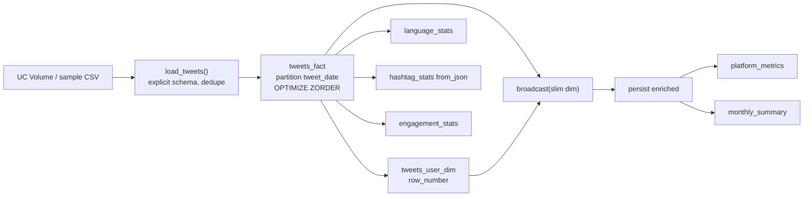

# PySpark Tweets Star Schema

A Databricks analytics pipeline that turns **38 million** Ukraine-war tweet CSVs into a partitioned Delta star schema, then measures platform concentration with an explicit **broadcast join**.

[](https://spark.apache.org/)
[](https://www.databricks.com/)
[](https://www.python.org/)


---

## Goal

Practice production-style PySpark on Databricks: a full small **star schema**, not a single-CSV `groupBy`.

1. **Partitioned fact table** — time-range scans without full-table reads  
2. **User dimension** — ranked by tweet volume (`row_number` → exact top-N)  
3. **Platform KPIs** — slim explicit `broadcast()` so the physical plan shows `BroadcastHashJoin`  
4. **Content analytics** — language amplification, hashtag trends, engagement mix  

Source: Ukraine tweet corpus on the DataExpert workspace (`/Volumes/tabular/dataexpert/tweets`).

---

## Runtime used for the full run

| Item | Value |
|------|------:|
| Databricks Runtime | **19.x-scala2.13** (Spark **4.2.0** on cluster) |
| Cluster | DataExpert All purpose — driver/worker **m4.xlarge**, autoscaling **1–2** workers |
| `tweets_fact` size | **~3.77 GiB** (4,050,537,366 bytes), 314 files, partitioned by `tweet_date` |
| `tweets_user_dim` size | **~52.7 MiB** (55,296,716 bytes), 1 file — **feasible to broadcast** after column pruning |

---

## Output tables

| Layer | Table | Rows | Purpose |
|-------|-------|-----:|---------|
| Fact | `tweets_fact` | **38,154,845** | One row per tweet, partitioned by `tweet_date` |
| Dimension | `tweets_user_dim` | **4,066,947** | One row per user with `volume_rank` |
| Metrics | `tweets_platform_metrics` | 1 | Concentration KPIs (+ median / p95 retweets) |
| Monthly | `tweets_monthly_summary` | months | Pre-aggregated month KPIs |
| Content | `tweets_language_stats` | languages | Tweet share vs population share |
| Content | `tweets_hashtag_stats` | top 50 | Hashtag volume ranking |
| Content | `tweets_engagement_stats` | 1 | Original / retweet / reply mix |

---

## Results

### Platform concentration

| Metric | Value |
|--------|------:|
| Total tweets | **38,154,845** |
| Distinct users | **4,066,947** |
| Top 10 tweeters → share of all tweets | **2.00%** |
| Top 100 tweeters → share of all tweets | **5.01%** |
| Big accounts (≥100k followers) → share of tweets | **1.63%** |
| Avg retweets per tweet | **440.26** (skewed — use median / p95 in metrics table) |
| Avg favorites per tweet | **2.9** |
| Avg followers (top 10 tweeters) | **5,312** |
| Avg followers (everyone else) | **18,611** |

Tweet *volume* and follower *reach* diverge: the top 10 posters by count are prolific small/mid accounts, not the largest influencers.

`is_top_10_tweeter` uses **`row_number`** (tie-break: followers, username) so the set is **exactly 10 users**, not “dense_rank ≤ 10” which can exceed 10 on ties.

### Engagement mix

| Type | Share |
|------|------:|
| Original | **88.63%** |
| Reply | **11.36%** |
| Retweet (flag / `RT @` heuristic) | **0.01%** |
| Quote | **0.00%** |

### Top languages (amplification = tweet % ÷ world population %)

| Language | Tweet % | Amplification |
|----------|--------:|--------------:|
| en | 61.13% | 3.82 |
| und | 6.33% | 63.30 |
| de | 6.02% | 4.01 |
| fr | 5.19% | 4.33 |
| it | 4.81% | 5.34 |
| es | 4.46% | 0.64 |
| uk | 2.70% | **6.75** |
| ru | 1.57% | 0.63 |

### Top hashtags

| Hashtag | Tweet count | % of all tweets |
|---------|------------:|----------------:|
| ukraine | 11,214,960 | 29.39% |
| russia | 4,950,556 | 12.97% |
| putin | 2,398,708 | 6.29% |
| standwithukraine | 1,715,811 | 4.50% |
| nato | 1,365,185 | 3.58% |

### Top 5 accounts by tweet volume

| Rank | Username | Tweets | Followers |
|-----:|----------|-------:|----------:|
| 1 | FuckPutinBot | 425,726 | 309 |
| 2 | rogue_corq | 47,837 | 2,095 |
| 3 | Hkjhgc2 | 45,711 | 73 |
| 4 | UlfaniaEda | 45,378 | 117 |
| 5 | kanadianbest | 40,866 | 988 |

---

## Architecture



### Broadcast join (verified physical plan)

Only **metric columns** are broadcast (`username`, ranks, flags, `followers_count`) — not the full dim payload. Dim size on the full run is **~53 MiB**, well within typical broadcast budgets on this cluster.

```python
dim_slim = dim_df.select(*DIM_BROADCAST_COLS)
enriched = fact_df.join(broadcast(dim_slim), on="username", how="left")
enriched = enriched.persist()
ENRICHED_TOTAL = enriched.count()  # one materialization for all % breakdowns
```


| Side | Operator | Note |
|------|----------|------|
| Fact | `Scan parquet tweets_fact` | No `Exchange` — stays local |
| Dim | `Exchange` → `EXECUTOR_BROADCAST` | Slim BuildRight |
| Join | `BroadcastHashJoin LeftOuter BuildRight` | Confirmed |

Full plan: [`docs/assets/physical-plan.txt`](docs/assets/physical-plan.txt)

---

## Performance & data-quality practices (applied)

| Feedback | Implementation |
|----------|----------------|
| `multiLine` vs `wholeFile` | Keep **`multiLine=True`** (quoted tweet texts contain `\n`; sample: 276/500). Drop **`wholeFile`** (one task per file → kills parallelism) |
| Avoid repeated `.count()` | `FACT_TOTAL` / `ENRICHED_TOTAL` computed once; helpers take `total` |
| Cache reused frames | `enriched_tweets.persist()` then `unpersist()` |
| Broadcast size | Slim column projection before `broadcast()` |
| AQE / auto-broadcast | Default keeps 10 MiB threshold; `FORCE_EXPLICIT_BROADCAST=1` for demo |
| `ANALYZE` / `OPTIMIZE` | `OPTIMIZE … ZORDER BY (username, tweet_date)` + `ANALYZE TABLE … FOR ALL COLUMNS` |
| Incremental loads | `WRITE_MODE=merge` → staging + `MERGE` on `tweet_id` |
| Keys / constraints | Delta `CHECK (tweet_id IS NOT NULL)`, `CHECK (username IS NOT NULL)` + ingest dedupe |
| Normalize join keys | `lower(trim(username))` on ingest and dim |
| Explicit schema | `RAW_CSV_SCHEMA` `StructType` (no `inferSchema`) |
| Exact top-N | `row_number` (not `dense_rank`) |
| Hashtags | `from_json` after quote normalization |
| Robust stats | `percentile_approx` median + p95 for retweets/favorites |
| Monthly queries | Materialized `tweets_monthly_summary` |

---

## Auth & config

Placeholders in env defaults are intentional. Auth options:

1. **CLI profile (preferred):** `databricks auth login --profile dataexpert`
2. **PAT:** export `DATABRICKS_TOKEN=dapi...` (never commit tokens)

```bash
export DATABRICKS_HOST="https://dbc-7b106152-caf3.cloud.databricks.com"
export DATABRICKS_CLUSTER_ID="0208-074755-vt50q0b6"
export DATABRICKS_PROFILE="dataexpert"
# export DATABRICKS_TOKEN="dapi..."   # only if not using profile OAuth
export TARGET_SCHEMA="bootcamp_students.alperendavran"
export TWEETS_PATH="/Volumes/tabular/dataexpert/tweets/*.csv"
export WRITE_MODE="overwrite"          # or merge
export FORCE_EXPLICIT_BROADCAST="0"
```

Job template: [`jobs/tweets_star_schema_job.yml`](jobs/tweets_star_schema_job.yml)

---

## Offline / grader path (no Unity Catalog access)

```
data/sample_raw_tweets_500.csv   # raw CSV shape for ingest tests
data/sample_tweets_10k.csv       # 10k fact-shaped rows from the live run
tests/test_pipeline_helpers.py   # local Spark unit tests
```

```bash
python -m venv .venv && source .venv/bin/activate
pip install -r requirements.txt
pytest -q
```

### DESCRIBE DETAIL (live run)

```
tweets_fact      sizeInBytes=4050537366  numFiles=314  partitionColumns=[tweet_date]
tweets_user_dim  sizeInBytes=55296716    numFiles=1    partitionColumns=[]
```

Re-run on the cluster:

```sql
DESCRIBE EXTENDED bootcamp_students.alperendavran.tweets_fact;
DESCRIBE EXTENDED bootcamp_students.alperendavran.tweets_user_dim;
DESCRIBE DETAIL  bootcamp_students.alperendavran.tweets_fact;
DESCRIBE DETAIL  bootcamp_students.alperendavran.tweets_user_dim;
OPTIMIZE bootcamp_students.alperendavran.tweets_fact ZORDER BY (username, tweet_date);
ANALYZE TABLE bootcamp_students.alperendavran.tweets_fact COMPUTE STATISTICS FOR ALL COLUMNS;
ANALYZE TABLE bootcamp_students.alperendavran.tweets_user_dim COMPUTE STATISTICS FOR ALL COLUMNS;
```

---

## Layout

```
pyspark-tweets-star-schema/
├── README.md
├── requirements.txt
├── notebooks/tweets_star_schema_pipeline.py
├── jobs/tweets_star_schema_job.yml
├── data/
│   ├── sample_raw_tweets_500.csv
│   └── sample_tweets_10k.csv
├── tests/test_pipeline_helpers.py
└── docs/assets/
    ├── architecture.svg
    ├── broadcast-hash-join.png
    ├── run-results.png
    └── physical-plan.txt
```

---

## Metrics glossary

| Metric | Meaning |
|--------|---------|
| `pct_top_10_tweeters` | Share of tweets from the exact top-10 users (`row_number`) |
| `pct_big_accounts_100k_plus` | Share from accounts with ≥100k followers |
| `median_retweets` / `p95_retweets` | Robust engagement vs mean skewed by virality |
| `amplification_index` | Tweet language % ÷ estimated world population % |
| `concentration_index` | HHI-style Σ(share²) across users |
| `volume_tier` | `top_10` / `top_100` / `top_1000` / `long_tail` |

---

## Author

**Alperen Davran** — Data engineering practice project (DataExpert bootcamp, 2026)
