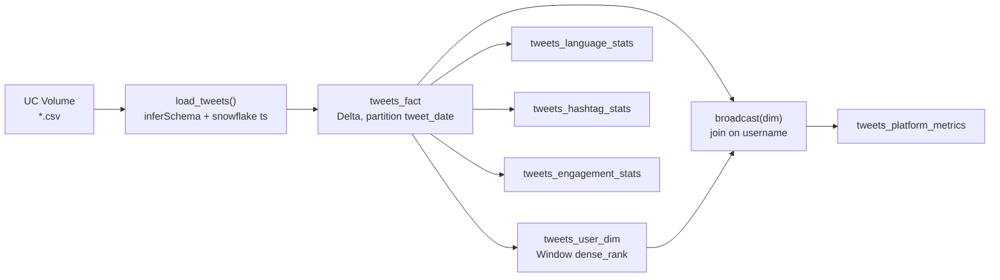

# PySpark Tweets Star Schema

**A Databricks analytics pipeline that turns 38 million Ukraine-war tweet CSVs into a partitioned Delta star schema, then measures platform concentration with an explicit broadcast join.**

[](https://spark.apache.org/)
[](https://www.databricks.com/)
[](https://www.python.org/)


---

## What I set out to do

I wanted to practice **production-style PySpark on Databricks** — not just `groupBy` on a single CSV, but a full small **star schema** with:

1. A **partitioned fact table** (time-range scans without full table reads)
2. A **user dimension** ranked by tweet volume
3. **Platform-level KPIs** joined via an **explicit `broadcast()`** so the physical plan shows `BroadcastHashJoin`
4. **Content analytics** — language amplification, hashtag trends, engagement mix

The dataset is the public Ukraine tweet corpus on the DataExpert Databricks workspace (`/Volumes/tabular/dataexpert/tweets`).

---

## What I built

| Layer | Output table | Rows (run) | Purpose |
|-------|--------------|------------|---------|
| **Fact** | `tweets_fact` | **38,154,845** | One row per tweet, partitioned by `tweet_date` |
| **Dimension** | `tweets_user_dim` | **4,066,947** | One row per user with `volume_rank`, tiers, flags |
| **Metrics** | `tweets_platform_metrics` | 1 | Concentration KPIs from broadcast join |
| **Content** | `tweets_language_stats` | ~languages | Tweet share vs population share |
| **Content** | `tweets_hashtag_stats` | top 50 | Hashtag volume ranking |
| **Content** | `tweets_engagement_stats` | 1 | Original / retweet / reply / quote mix |

---

## Key results

### Platform concentration

| Metric | Value | Interpretation |
|--------|------:|----------------|
| Total tweets | **38,154,845** | Full corpus after null filtering |
| Distinct users | **4,066,947** | ~9.4 tweets per user on average |
| **Top 10 tweeters → % of all tweets** | **2.0%** | A tiny group drives measurable volume |
| Top 100 tweeters → % of all tweets | **5.01%** | Concentration grows slowly down the rank |
| Big accounts (≥100k followers) → % of tweets | **1.63%** | Reach ≠ volume in this dataset |
| Avg retweets per tweet | **440.26** | Heavy tail from viral posts |
| Avg favorites per tweet | **2.9** | Lower than retweet amplification |
| Avg followers (top 10 tweeters) | **5,312** | High-volume accounts are often *not* celebrity-scale |
| Avg followers (everyone else) | **18,611** | Long tail includes bigger accounts posting less |

> **Takeaway:** tweet *volume* and follower *reach* are different dimensions. The top 10 posters by count are prolific small/mid accounts, not necessarily the largest influencers.

### Top 5 accounts by tweet volume

| Rank | Username | Tweets | Followers | Big account? |
|-----:|----------|-------:|----------:|:------------:|
| 1 | FuckPutinBot | 425,726 | 309 | No |
| 2 | rogue_corq | 47,837 | 2,095 | No |
| 3 | Hkjhgc2 | 45,711 | 73 | No |
| 4 | UlfaniaEda | 45,378 | 117 | No |
| 5 | kanadianbest | 40,866 | 988 | No |

---

## Architecture



### Why broadcast join?

The dimension (~4M users) is small enough to **replicate to every executor** instead of shuffling 38M fact rows. I disabled auto-broadcast to make the hint visible in the plan:

```python
spark.conf.set("spark.sql.autoBroadcastJoinThreshold", "-1")

enriched = (
    fact_df.alias("f")
    .join(broadcast(dim_df.alias("d")), on="username", how="left")
)
enriched.explain(mode="formatted")  # → BroadcastHashJoin LeftOuter BuildRight
```

**Expected physical plan fragment:**

```
BroadcastHashJoin LeftOuter BuildRight
:- Scan parquet ... tweets_fact        # fact stays local — no Exchange
+- Exchange                             # only the dim side shuffles once, then broadcasts
   +- Scan parquet ... tweets_user_dim
```


*Illustration of the expected plan. Drop your real Spark UI capture at `docs/assets/broadcast-hash-join.png` to override.*

---

## Data engineering lessons

### Mixed CSV schemas (18 vs 29 columns)

Older daily files have **18 columns**; newer files add `is_retweet`, `is_quote_status`, reply metadata, etc. (**29 columns**).

When Spark reads all files with `inferSchema=True`, it keeps the **18-column schema**. In newer files, column 18 is `is_retweet` (`true`/`false`), which Spark mis-maps as `extractedts` — about **30M rows** end up with boolean `false` in that slot.

**My fix (minimal):** drop `extractedts` entirely; derive `tweet_ts` from the Twitter snowflake ID + `tweetcreatedts`.

### Hashtag parsing

Hashtags are stored as Python-list-like strings: `[{'text': 'Ukraine', 'indices': [...]}]`. Extraction uses `regexp_extract_all` with the pattern wrapped in `F.lit()` so Spark does not treat the regex as a column name.

---

## Tech stack

| Component | Choice |
|-----------|--------|
| Compute | Databricks all-purpose cluster |
| Local dev | Databricks Connect + VS Code / Cursor |
| Storage | Unity Catalog + Delta Lake on S3 |
| Ingest | CSV from UC Volumes (`multiLine`, `wholeFile`) |
| Transform | PySpark DataFrame API, Window functions |
| Join strategy | Explicit `broadcast()` + plan verification |

---

## Project structure

```
pyspark-tweets-star-schema/
├── README.md
├── requirements.txt
├── notebooks/
│   └── tweets_star_schema_pipeline.py   # full Databricks notebook (.py source)
└── docs/
    └── assets/
        ├── architecture.svg
        ├── SCREENSHOTS.md               # what to capture from Spark UI
        └── broadcast-hash-join.png      # ← add your screenshot
```

---

## How to run

### 1. Prerequisites

- Databricks workspace with access to the tweet Volume (or your own CSV path)
- Python 3.12 + `databricks-connect`
- CLI profile: `databricks auth login --profile <your-profile>`

### 2. Configure environment

```bash
export DATABRICKS_HOST="https://<workspace>.cloud.databricks.com"
export DATABRICKS_CLUSTER_ID="<cluster-id>"
export DATABRICKS_PROFILE="<profile>"
export TARGET_SCHEMA="<catalog>.<schema>"
export TWEETS_PATH="/Volumes/tabular/dataexpert/tweets/*.csv"
```

### 3. Run the notebook

Open `notebooks/tweets_star_schema_pipeline.py` in Databricks or VS Code with the Databricks extension. Execute cells top to bottom.

---

## Metrics glossary

| Metric | Meaning |
|--------|---------|
| `pct_top_10_tweeters` | Share of all tweets posted by the 10 most prolific users |
| `pct_big_accounts_100k_plus` | Share of tweets from accounts with ≥100k followers |
| `amplification_index` | Tweet language % ÷ estimated world population % (>1 = over-represented) |
| `concentration_index` | HHI-style Σ(share²) across users — closer to 0 = even distribution |
| `volume_tier` | `top_10` / `top_100` / `top_1000` / `long_tail` |

---

## Author

**Alperen Davran** — Data engineering practice project (DataExpert bootcamp, 2026)

If this helped you understand star schemas or broadcast joins on Databricks, feel free to ⭐ the repo.
