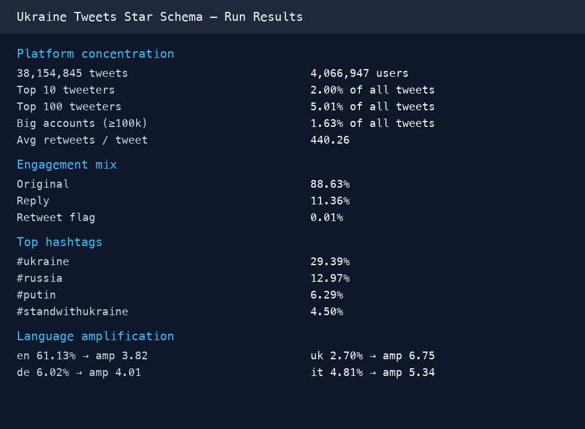
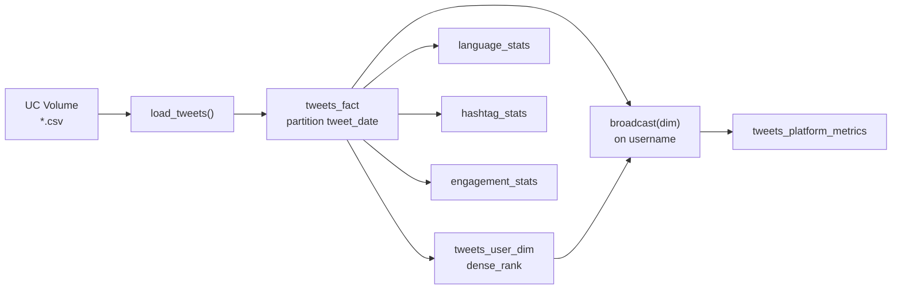
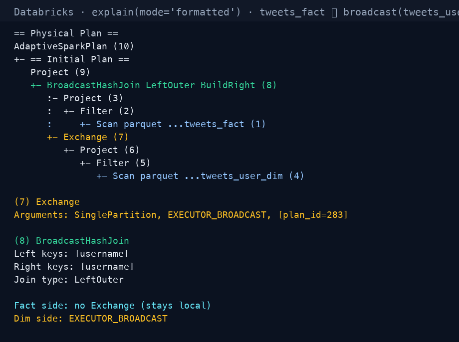

# PySpark Tweets Star Schema

A Databricks analytics pipeline that turns **38 million** Ukraine-war tweet CSVs into a partitioned Delta star schema, then measures platform concentration with an explicit **broadcast join**.

[](https://spark.apache.org/)
[](https://www.databricks.com/)
[](https://www.python.org/)




---

## Goal

Practice production-style PySpark on Databricks: a full small **star schema**, not a single-CSV `groupBy`.

1. **Partitioned fact table** — time-range scans without full-table reads  
2. **User dimension** — ranked by tweet volume (`volume_rank`, tiers, flags)  
3. **Platform KPIs** — explicit `broadcast()` so the physical plan shows `BroadcastHashJoin`  
4. **Content analytics** — language amplification, hashtag trends, engagement mix  

Source: Ukraine tweet corpus on the DataExpert workspace (`/Volumes/tabular/dataexpert/tweets`).

---

## Output tables

| Layer | Table | Rows | Purpose |
|-------|-------|-----:|---------|
| Fact | `tweets_fact` | **38,154,845** | One row per tweet, partitioned by `tweet_date` |
| Dimension | `tweets_user_dim` | **4,066,947** | One row per user with `volume_rank` |
| Metrics | `tweets_platform_metrics` | 1 | Concentration KPIs from broadcast join |
| Content | `tweets_language_stats` | languages | Tweet share vs population share |
| Content | `tweets_hashtag_stats` | top 50 | Hashtag volume ranking |
| Content | `tweets_engagement_stats` | 1 | Original / retweet / reply mix |

---

## Results

### Platform concentration

| Metric | Value |
|--------|------:|
| Total tweets | **38,154,845** |
| Distinct users | **4,066,947** |
| Top 10 tweeters → share of all tweets | **2.00%** |
| Top 100 tweeters → share of all tweets | **5.01%** |
| Big accounts (≥100k followers) → share of tweets | **1.63%** |
| Avg retweets per tweet | **440.26** |
| Avg favorites per tweet | **2.9** |
| Avg followers (top 10 tweeters) | **5,312** |
| Avg followers (everyone else) | **18,611** |

Tweet *volume* and follower *reach* diverge: the top 10 posters by count are prolific small/mid accounts, not the largest influencers.

### Engagement mix

| Type | Share |
|------|------:|
| Original | **88.63%** |
| Reply | **11.36%** |
| Retweet (flag / `RT @` heuristic) | **0.01%** |
| Quote | **0.00%** |

### Top languages (amplification = tweet % ÷ world population %)

| Language | Tweet % | Amplification |
|----------|--------:|--------------:|
| en | 61.13% | 3.82 |
| und | 6.33% | 63.30 |
| de | 6.02% | 4.01 |
| fr | 5.19% | 4.33 |
| it | 4.81% | 5.34 |
| es | 4.46% | 0.64 |
| uk | 2.70% | **6.75** |
| ru | 1.57% | 0.63 |

Ukrainian (`uk`) is strongly over-represented relative to global population share.

### Top hashtags

| Hashtag | Tweet count | % of all tweets |
|---------|------------:|----------------:|
| ukraine | 11,214,960 | 29.39% |
| russia | 4,950,556 | 12.97% |
| putin | 2,398,708 | 6.29% |
| standwithukraine | 1,715,811 | 4.50% |
| nato | 1,365,185 | 3.58% |

### Top 5 accounts by tweet volume

| Rank | Username | Tweets | Followers |
|-----:|----------|-------:|----------:|
| 1 | FuckPutinBot | 425,726 | 309 |
| 2 | rogue_corq | 47,837 | 2,095 |
| 3 | Hkjhgc2 | 45,711 | 73 |
| 4 | UlfaniaEda | 45,378 | 117 |
| 5 | kanadianbest | 40,866 | 988 |

---

## Architecture



### Broadcast join (verified physical plan)

The dimension (~4M users) is replicated to every executor instead of shuffling 38M fact rows. Auto-broadcast was disabled so the explicit hint stays visible:

```python
spark.conf.set("spark.sql.autoBroadcastJoinThreshold", "-1")

enriched = (
    fact_df.alias("f")
    .join(broadcast(dim_df.alias("d")), on="username", how="left")
)
enriched.explain(mode="formatted")
```

Captured from the live Databricks cluster:



| Side | Operator | Note |
|------|----------|------|
| Fact | `Scan parquet tweets_fact` | No `Exchange` — stays local |
| Dim | `Exchange` → `EXECUTOR_BROADCAST` | Built once, sent to executors |
| Join | `BroadcastHashJoin LeftOuter BuildRight` | Confirmed in plan |

Full plan text: [`docs/assets/physical-plan.txt`](docs/assets/physical-plan.txt)

---

## Data engineering notes

### Mixed CSV schemas (18 vs 29 columns)

Older daily files have **18 columns**; newer files add `is_retweet`, `is_quote_status`, reply metadata (**29 columns**).

With `inferSchema=True` across a glob, Spark keeps the **18-column schema**. In newer files column 18 is `is_retweet` (`true`/`false`), mis-mapped as `extractedts` (~30M rows).

**Fix:** ignore `extractedts`; derive `tweet_ts` from the Twitter snowflake ID + `tweetcreatedts`.

### Hashtag parsing

Hashtags arrive as Python-list-like strings: `[{'text': 'Ukraine', 'indices': [...]}]`. Extraction uses `regexp_extract_all` with the pattern wrapped in `F.lit()` so Spark does not treat the regex as a column name.

---

## Stack

| Component | Choice |
|-----------|--------|
| Compute | Databricks all-purpose cluster |
| Local client | Databricks Connect |
| Storage | Unity Catalog + Delta Lake |
| Ingest | CSV from UC Volumes (`multiLine`, `wholeFile`) |
| Transform | PySpark DataFrame API, Window functions |
| Join | Explicit `broadcast()` + plan verification |

---

## Layout

```
pyspark-tweets-star-schema/
├── README.md
├── requirements.txt
├── notebooks/
│   └── tweets_star_schema_pipeline.py
└── docs/assets/
    ├── architecture.svg
    ├── broadcast-hash-join.png
    ├── run-results.png
    └── physical-plan.txt
```

---

## Run

```bash
export DATABRICKS_HOST="https://dbc-7b106152-caf3.cloud.databricks.com"
export DATABRICKS_CLUSTER_ID="<cluster-id>"
export DATABRICKS_PROFILE="dataexpert"
export TARGET_SCHEMA="bootcamp_students.alperendavran"
export TWEETS_PATH="/Volumes/tabular/dataexpert/tweets/*.csv"
```

Open `notebooks/tweets_star_schema_pipeline.py` in Databricks or VS Code (Databricks extension) and execute cells top to bottom.

---

## Metrics glossary

| Metric | Meaning |
|--------|---------|
| `pct_top_10_tweeters` | Share of all tweets from the 10 most prolific users |
| `pct_big_accounts_100k_plus` | Share from accounts with ≥100k followers |
| `amplification_index` | Tweet language % ÷ estimated world population % |
| `concentration_index` | HHI-style Σ(share²) across users |
| `volume_tier` | `top_10` / `top_100` / `top_1000` / `long_tail` |

---

## Author

**Alperen Davran** — Data engineering practice project (DataExpert bootcamp, 2026)
